#  DarkModeDemo-UIKit
## Preparing for iOS 13 Dark Mode


# Theory
Following the introduction of support for **Dark Mode** in macOS, the release of iOS 13 sees iOS devices gain dark mode settings. 
While supporting dark mode is not mandatory at this point, most developers will want to review existing apps to see how they look.
Certainly all newly developed apps should provide explicit support for dark mode.
Happily, supporting dark mode is normally fairly simple. Unless, that is, your design uses lots of "static" custom colors (see below).

At a basic level, all you need to do to support dark mode is re-build your app with the iOS 13 SDK.
All UIKit views such as labels, table views and buttons have been updated to automatically render themselves correctly when dark mode is enabled.

There are likely three main areas where manually review or changes will be necessary:

1. **Static colors**. Where your apps uses colors like **UIColor.red** or **UIColor(red: 0, green: 255, blue: 0, alpha: 1)**
2. **Images**. For example, where an image has a white or light-colored border
3. **Storyboards**. For example, color attributes that use non-default values

___

## Detecting Dark Mode/Light Mode switches
As we'll see, there are often better ways to handle switches between display modes. 
However, if you need to *programmatically* detect when the display mode changes you can use the following 
**traitCollectionDidChange(_:)** code as a template:

``` swift
class TableViewController: UITableViewController {

    override func traitCollectionDidChange(_ previousTraitCollection: UITraitCollection?) {
        super.traitCollectionDidChange(previousTraitCollection)

        switch traitCollection.userInterfaceStyle {
            case .dark: darkModeEnabled()   // Switch to dark mode colors, etc.
            case .light: fallthrough
            case .unspecified: fallthrough
            default: lightModeEnabled()   // Switch to light mode colors, etc.
        }
    }

    private func lightModeEnabled() { ... }
    private func darkModeEnabled() { ... }
}
```

## Static colors
Using static colors like **UIColor.red** or **UIColor(red: 255, green: 0, blue: 0, alpha: 1)** means that when the user switches display modes 
those colors do not automatically adapt. A better practice is to define *adaptive colors* in the asset catalog.

Open the asset catalog, right-click in the list of assets (or click the “+” at the bottom of the asset pane) and select **New Color Set**:

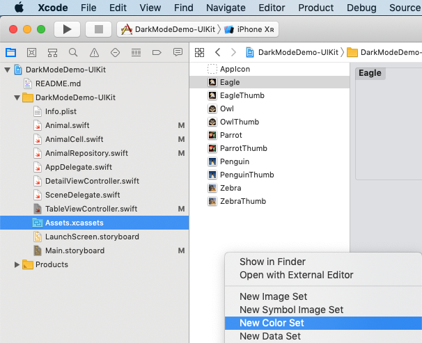

You’ll see:

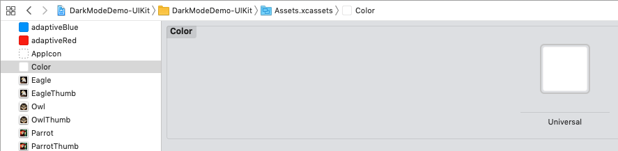

In the **Attribute Inspector** select **Any, Light, Dark** from the **Appearance** dropdown list:

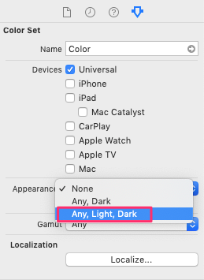

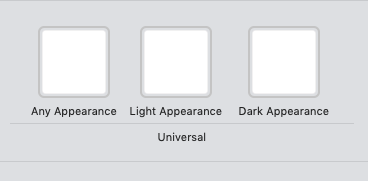

You can now name the define the color you want for each display mode:

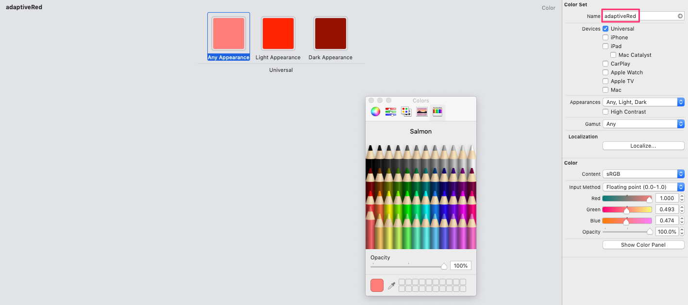

You can then use the color in Interface Builder or in code:

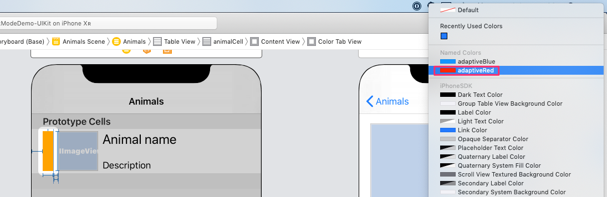

``` swift
// The colors adaptiveRed and adaptiveBlue are defined in the asset catalogue
cell.colorTabView.backgroundColor = UIColor(named: selectedAnimal.canFly ? "adaptiveRed" : "adaptiveBlue")
```

In the above code snippet I’m adding a background color to a View in a custom table view cell. 
You can see the color adapts according to light or dark mode being selected:


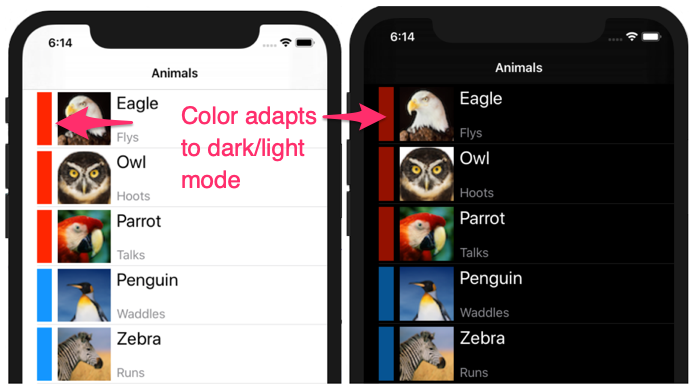

## Images
In a very similar way as for adaptive colors, we can make use of adaptive images in the asset catalog.

Select an image in the asset catalog and then select **Any, Dark** from the **Appearance** dropdown list:

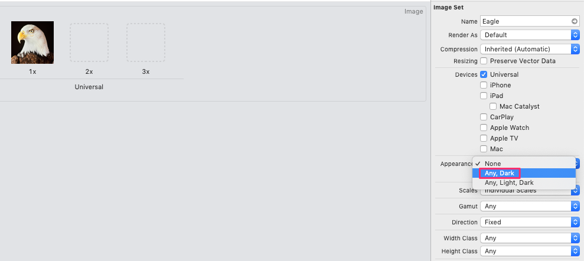

Now drag in a new image for for use in dark mode:

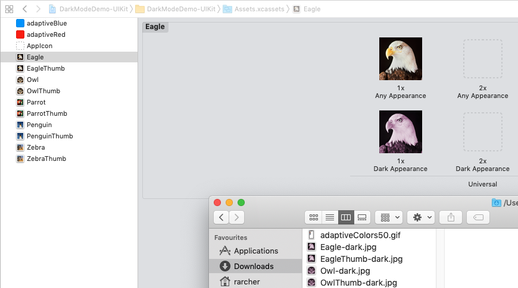

In this example I’m adding images to the table view like this:

``` swift
// thumbName is the name of an adaptive image in the asset catalog
cell.animalImageView.image = UIImage(named: selectedAnimal.thumbName)
```

You can see that the image adapts automatically when the display mode changes:

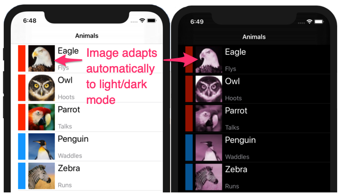

## Storyboards
The easiest way to ensure that storyboards can automatically adapt to the selected display mode is by using system 
colors and named adaptive colors and images.

For example, here my tableview uses the default **Default Label Color** for the main or title label:

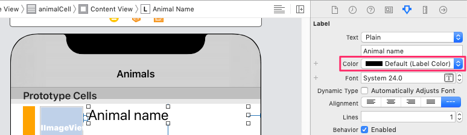

This is how it looks in light and dark mode:

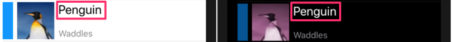

Here I wanted a slightly smaller, less prominent font and color for descriptive text. Using **Secondary Label Color** is a good choice for this:

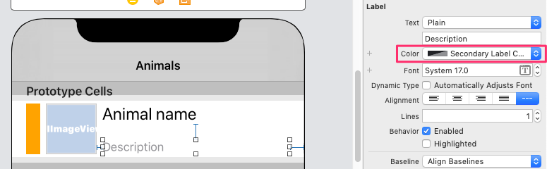

___

# Practice: Updating Writerly
I recently finished updating one of my App Store apps (Writerly [https://apps.apple.com/app/writerly/id1143101981?ls=1]) for iOS 13 and 
dark mode. The app is essentially a tableview master-detail where pages are selected from a list and content shown in a detail view controller. 
The content itself is large amounts of formatted text. The text also contains images, buttons, links, and other interactive elements and is 
created as HTML, CSS rendered in a **WKWebView**. Interactive elements on the HTML page communicate with the iOS core of the 
app using Javascript.

Although I encountered very few real issues, the main things are noted below.

## Storyboard defaults
When I first enabled dark mode the app mostly did not appear to notice! A quick review of the storyboard showed that in lots of places I’d used
custom static colors. Changing these for suitable default and system colors very quickly solved most of the glaring issues.

## Programmatic non-static colors
In a few places (e.g. **tableView(__:cellForRowAt:)** and **tableView(_:viewForHeaderInSection:)**) I was setting static custom 
colors to provide the user with visual clues to different types of content. By using adaptive colors as outlined above I was quickly 
able to make things look presentable in light and dark modes:

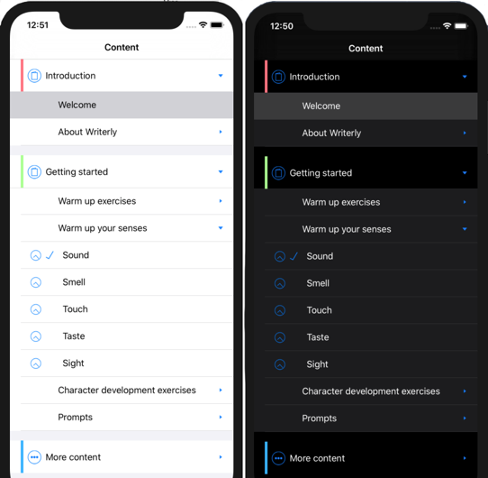

## WKWebView stylesheet media dark
My biggest area of concern was over fifty HTML pages and about a hundred images, all of which had been designed for light mode. In the back of
my mind was the *hope* that there would be some sort of media query that I could use in the stylesheet to automatically switch designs between
dark and light mode. Amazingly, this turned out to be true and was remarkably straightforward to implement!

The magic media query turns out to be:

``` html
@media(prefers-color-scheme: dark) { ... }
``` 

So, all I had to do was tag a dark mode section to the end of the existing stylesheet and my pages adapted themselves rather nicely:

``` html
:root { color-scheme: light dark; }  /* Let WebKit know we support light mode and dark mode */
/* Explicit styles for light mode */
html { background-color: white; -webkit-touch-callout: none; -webkit-user-select: none; }  
body { background-color: white; color: #4A4A4A; font-size: 1.2em; font-family: -apple-system; }  
h3 {color: #305377; }
h4 {color: #305377; }
h5 {color: #305377; }
:
:
/* Explicit styles for dark mode */
@media(prefers-color-scheme: dark) {
    html { background-color: #303030; }  /* Dark grey */
    body { background-color: #303030;  color: #D6D6D6; }  /* Dark grey; silver */
    h3 {color: #942193; }  /* Plum */
    h4 {color: #942193; }  /* Plum */
    h5 {color: #942193; }  /* Plum */
    :
    :
}
``` 

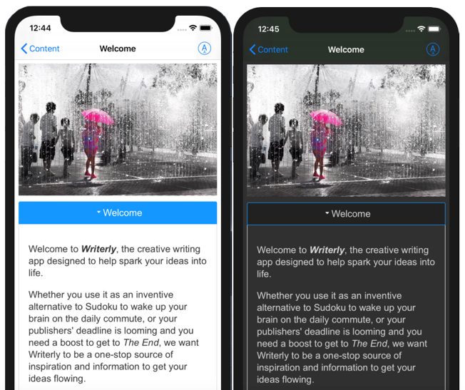

## HTML using media queries on 
The final thing I had to do was adjust a few images. For example, where they had prominent white borders.
To automatically switch between light and dark mode images all that’s required is to replace **** elements with 
**<picture>**, as the latter supports media queries:

``` html
<!--  -->
<picture>
    <source class="page-image" srcset="intro-how-to-use-ipad-dark.jpg" media="(prefers-color-scheme: dark)">
    
</picture>
```

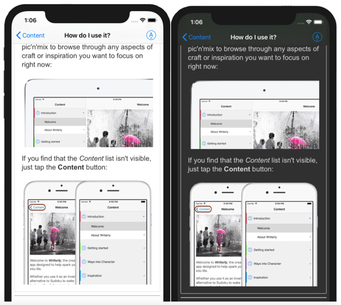

See https://webkit.org/blog/8840/dark-mode-support-in-webkit/ for more details.
